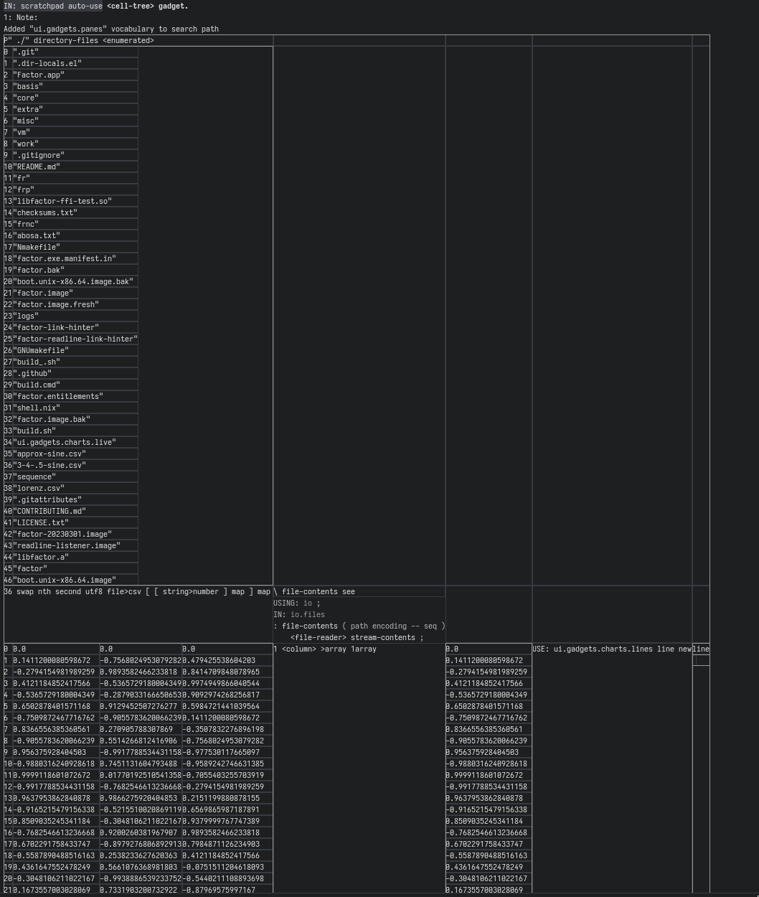

# factor cell

A factor version of treesheets, with less focus on typesetting and more focus on a live factor environment.

It is a hierarchical spreadsheet where any cell can be executed, depending on the direction chosen (ctrl+  < , > , v , ^ ) it will use the cells before as argument inputs ( if anything need be taken off the stack ), the cells after to display what is left on the stack and each cell has a pane to display side-effectful things (i.e. live gadgets and the general clickability of factor)

Originally intended to be for laying out my drawings and writing for easier export to html/epub/pdf (checkout my illustrated, science-fiction epic poem if you want to read about a sad spaceman for an hour or two: https://inivekin.github.io/abosa - hopefully my next thing has more levity)

Regard:

note:
- for now things turn up as subtrees if they are a matrix, it may also try to layout a class left on the stack in a special way that doesn't yet get passed in
- cells auto-insert if outgoing datastack overflows matrix, it will raise error if ingoing cells don't provide enough datastack
- keyboard bindings can be seen at the bottom of the scaling-editor.factor file... I provide no psychological warranty if you look at the rest

general wishlist:

1. general rewrite of emotionally distressing code
    a. ensure cells output format can always be input - homoiconicity must be maintained
    b. figure out best parsing practicers, steal more from the 1dimensional listener
    c. better gaps, highlight selections, make grid behaviour edittable within the grid - this should be usable as a gui builder too
2. try to see if there is a less janky way to resize font/reflow text maybe
3. images
4. serialise to json for saving/loading grids (and for editting text-heavy cells in a better text editor)
5. serialise to html for static site layout
6. macro cell referencing - allowing for arbitrary cell linkingi across the grid (absolute and relative, of the for @A0 continue for more depth e.g. @B3A2C1)
7. modal selection/editting keybindings
8. live cells as well as dead cell (better updating of objects in the grid)
9. uiua-esque syntax option for more array-like handling?

