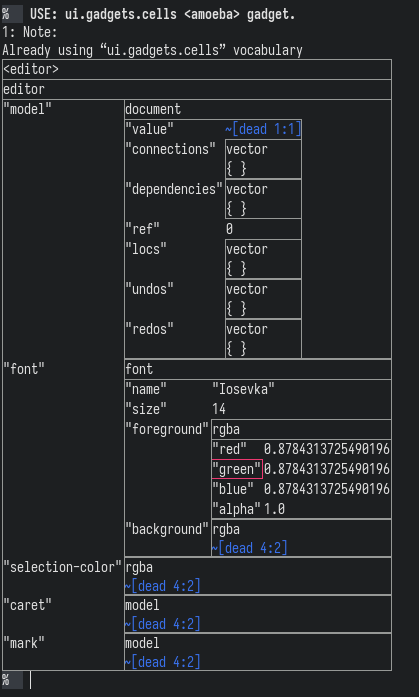

# factor cell

A hierarchical spreadsheet where any cell can be executed, depending on the direction chosen (ctrl+  < , > , v , ^ ) it will use the cells before as argument inputs ( if anything need be taken off the stack ), the cells after to display what is left on the stack and each cell has a pane to display side-effectful things (i.e. live gadgets and the general clickability of factor)

A factor version of treesheets, with less focus on typesetting and more focus on a live factor environment.

Regard:

goal: make treesheets and tiddlywiki kiss while chewing factor-flavoured bubblegum

status: building foundations until cell behaviours can start being written/loaded in themselves

features:
- dead cells: contain an mitochndria for editting cell genome and viewing cell membrane
- cell metabolics: so cells can consume and produce other cells by the given function (convert the incells to cellouts)
- prison cells: so large/nested matrices/objects are collapsible

TODO-features:
- cells. interlinked.
    - macro for @/0 for absolute cell referencing
    - macro for &/0 &-a-1 for relative cell referencing
            - &-a is the left cell, &a is the right
            - &-1 is the above cell, &1 is the below
            - &A1 is diagonally below and right
            - &a1b2... choose subcells by continuing letter-number pairs
    - & Is current cell contents, @ is top cell contents
        - && Is current cell gadget, @@ is top cell gadget (allows cells to start programming each other/themselves)
    - &-1-A:1A allow `:` to reference matrices of cells
        - (Add a reference for currently focussed cell?)
    - collections of interlinked cells can form functional blocks (stem cells?)
- cell selection: improving group (cell submatrixing) and group actions (maybe might be better to use cell interlinking?)
- serialise to some standard format (html? org-mode? can just save as factor code or object>bytes for now. call it a colony file?)
- live cells
    - the current dead cells only present text that needs reparsing, allow cells that are a refernce to be conserved (and presented in a pane?)
- a stringy cell
    - for text formatting (italics/bold/underline/font?) and try to have this reflow/softwrap text
- cell imaging
    - pngs or jpegs (maybe svgs later)
- cancer cells
    - special hidden cells to manage special state that would surely become an issue if not monitored...
- cryogenics
    - a hashmap for cells you want connected but not displayed. searchable by fuzzy menu
- autonomous cells?
    - threading and updating?
- splinter cells
    - not sure what this would be but would be a cool name for a thing

TODO-bugs:
- fix your broken tests
- hard to see level of cell wall embedding (i.e. cannot insert cell outside cell wall when at edge of cell or navigate cell levels with precision )
- figure out keybindings and if modal editting behaviour is wanted (depends on how selection should work)
- re-parse tuple-organised outputs properly when used as input
- prison cells can be more informative on what is inside when collapsed
    - give prison cells a prison window (scrollable fixed-width)
- keep removing rows/columns until all gone you are left with an unuseful void in the grid

Originally intended to be for laying out my drawings and writing for easier export to html/epub/pdf (checkout my illustrated, science-fiction epic poem if you want to read about a sad spaceman for an hour or two: https://inivekin.github.io/abosa - hopefully my next thing has more levity)

